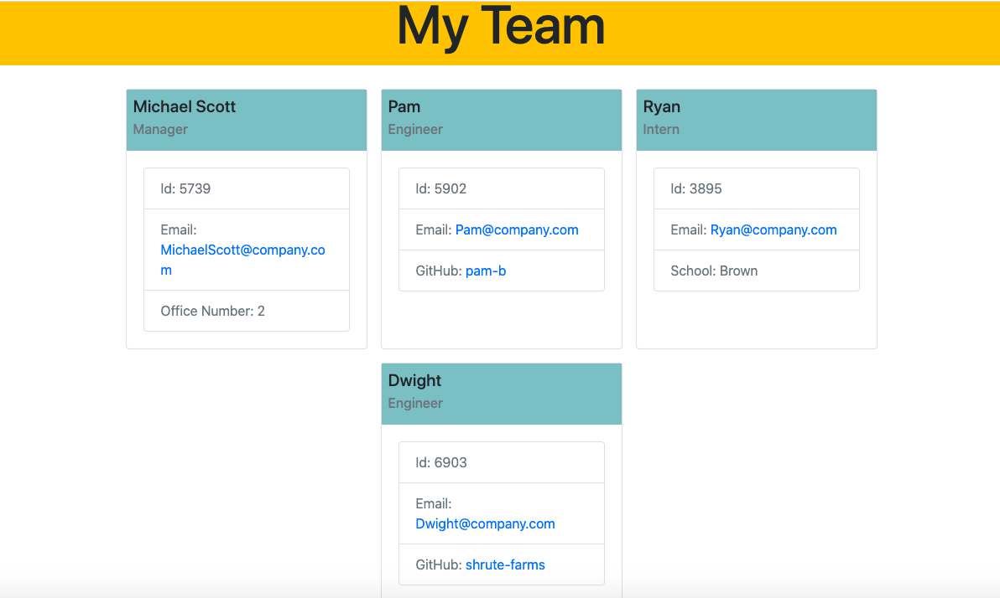

# Employee Profile Generator

## Description

A command line application that generates a HTML page full of employee information based on user input.

## Purpose 

A quick and easy way to input employee data and get a comphrehensive visual display of that data.

## How to use:

- Download files to your device
- Open command line interface
- Navigate into the root directory
- Run `node index`
- Follow command line prompts
- After answering all questions and finishing, open the index.html located in the /dist folder

## Screenshot

## Built using:

- Node.js
- Inquirer package
- HTML
- Bootstrap
